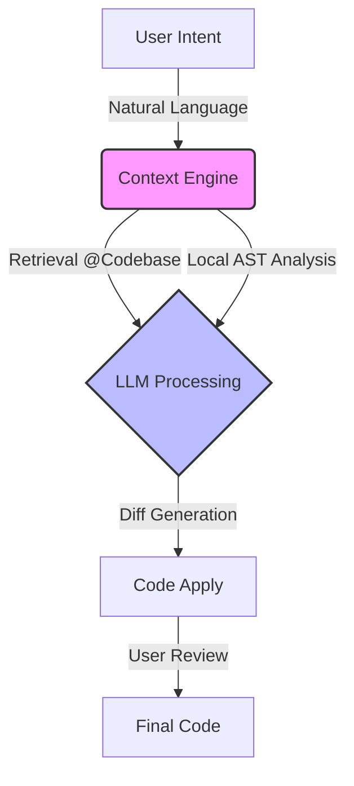

# Module 01: The Cursor Mental Model

*From Text Editor to Context Engine.*

## 1. The High-Level Roadmap

Before pressing keys, understand where we are going. Real mastery of Cursor isn't about memorizing shortcuts; it's about managing **Context** and **Intent**.

## 2. The Core Concept: "Context is King"

Most developers treat AI tools like a **Search Engine** (Ask question → Get answer).
**Cursor Strategy**: Treat AI like a **Senior Pair Programmer** who just joined the team 5 minutes ago.

### The "5-Minute Colleague" Theory

If a new senior engineer sat next to you, they wouldn't know:

- Which file holds the auth logic.
- Why you used a specific library 3 years ago.
- That `User` class is actually deprecated.

**You must provide Context.**

| Approach | Traditional Copilot | Cursor Approach |
| :--- | :--- | :--- |
| **Input** | "Write a function to sort list" | "Look at `@UserUtils.ts`, use the sort logic there to sort `@NewList`" |
| **Mechanism** | Text Prediction (Autocomplete) | Context-Aware Diffing |
| **Outcome** | Generic Code | Project-Specific, Consistent Code |

## 3. Why It Works (The "Why")

Cursor works differently because it doesn't just "read" your open file. It maintains a **Vector Database** of your local codebase.

1. **Indexing**: When you open a folder, Cursor scans and indexes code chunks.
2. **Semantic Search**: It understands "Authentication" even if you only search "Login".
3. **AST Awareness**: It knows that changing a function signature in File A requires updates in File B.

## 4. Practical Use Case: The "Smart" Refactor

**Scenario**: You need to update a variable name across a distributed system (e.g., frontend and backend types).

- **Old Way**: `Ctrl+F`, Replace, check for errors, run tests.
- **Cursor Way**: "Using `@types/user.ts` as the source of truth, update the variable `is_active` to `isActive` in `@backend/models.py` and ensure the JSON serialization handles the case conversion."

**Why this matters**: You shifted from *doing* the edit to *defining* the architectural change.

## 5. Guided Hands-On Exercise: The "Context verification"

*Goal: Prove to yourself that Cursor "sees" what you don't show it.*

**Setup**:

1. Open any existing project (or create a dummy folder with 2 files).
2. Create `file_a.txt`: Write "The secret execution code is 8822."
3. Create `file_b.txt` (Empty).
4. **Close `file_a.txt`** (This is crucial. It is not in your visible tabs).

**Action**:

1. Open `file_b.txt`.
2. Press `Cmd+K` (Generate).
3. Type: "Write a sentence that includes the secret code from file_a."

**Observation**:

- **If it fails**: You haven't indexed or referenced it correctly.
- **If it works**: Cursor pulled data from a closed file via its index. This is the "Eureka" moment.

## 6. Review & Common Mistakes

* **Mistake**: Assuming the AI knows everything without `@` references.
  - *Correction*: Always be explicit with context when the task is complex.
- **Mistake**: Treating the Chat like ChatGPT web UI.
  - *Correction*: The Chat is for *codebase* inquiries. Use `Cmd+K` for *in-file* actions.

## 7. Key Takeaways

1. **Cursor != VS Code + Plugin**. It is a fork that indexes your file system.
2. **Input = Intent + Context**. Just "Intent" leads to hallucinations.
3. **Codebase Awareness**: The distinct power is accessing closed files and understanding relationships.

## 8. When to use vs. When NOT to use

| Feature | Use When... | Avoid When... |
| :--- | :--- | :--- |
| **Global Context** | Explaining architect level impacts. | You need a precise, single-line regex fix (Overkill). |
| **Indexing** | You start a meaningful project. | You are editing a single script in `/tmp`. |

---
*Next Module: The Tactical Suite (Cmd+K vs Chat vs Composer)*
