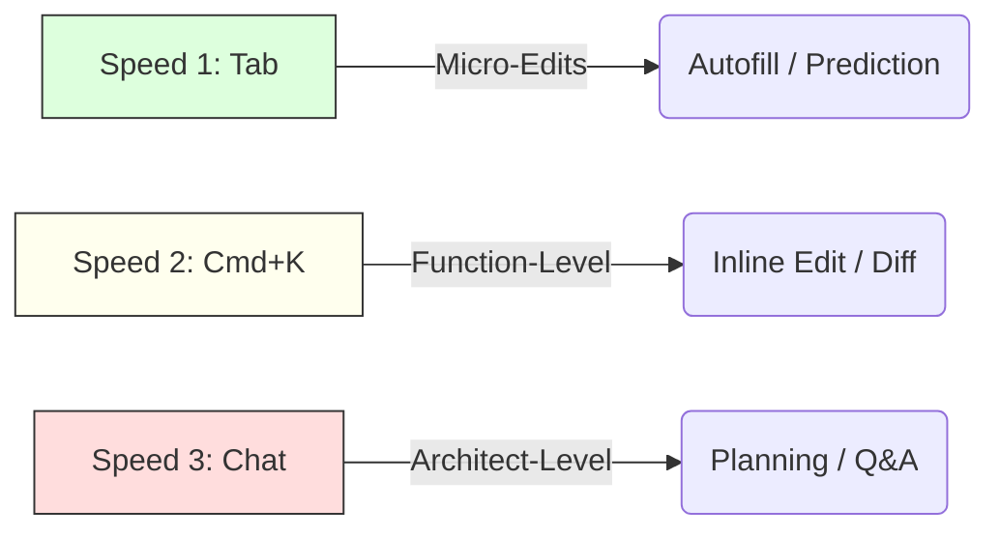

# Module 02: The Tactical Suite

*Mastering the three modes of interaction: Tab, Edit, and Chat.*

## 1. The Interaction Triangle

You interact with Cursor in three distinct "speeds." Choosing the right speed is 80% of the efficiency gain.



## 2. Speed 1: "Tab" (The Ghost)

**What it is**: Copilot ++. Real-time code prediction.
**Why it's better**:

- It predicts next *edits*, not just next code. If you delete a line, it might predict deleting the corresponding closing brace.
- It predicts *cursor movement*.

**Practitioner Tip**:

- Don't just type. Pause. Let the Ghost show you the way.
- Use `Tab` to accept, `Esc` to reject.
- *Pro Move*: Use `Ctrl+RightArrow` to accept word-by-word if the prediction is "mostly" right but wrong at the end.

## 3. Speed 2: "Cmd+K" (The Scalpel)

**What it is**: The **Inline Edit** prompt.
**Shortcut**: `Ctrl+K` (Windows) / `Cmd+K` (Mac).

**The Workflow**:

1. Highlight code (or place cursor on an empty line).
2. Press `Cmd+K`.
3. Type instructions: "Refactor this to use async/await."
4. **Review the Diff**.
    - <span style="color:red">Red</span>: Deletion.
    - <span style="color:green">Green</span>: Addition.
5. Accept/Reject.

**Why use this?**

- It keeps you in the **Flow State**. You don't leave the file.
- It is strictly focused on the *selected region*.

## 4. Speed 3: "Chat" (The Brain)

**What it is**: The Sidebar Interface (`Cmd+L`).
**When**: "I don't know *where* to write the code" or "I have a big error."

**Key Capability**: **Symbol Reference (@)**.

- Type `@Files` to index specific files.
- Type `@Codebase` to search the entire project.
- Type `@Docs` to read documentation (e.g., React, Stripe).

## 5. Guided Hands-On Exercise: The "Fix & Refactor" Loop

*Goal: Use all three speeds in one task.*

**Setup**:
Create a messy function in a JS/Python file:

```javascript
function calc(a, b) {
    // this is bad code
    var x = a + b;
    console.log(x);
    if(x > 10) return true;
    else return false;
}
```

**Step 1 (Chat - Plan)**:

- Open Chat (`Cmd+L`).
- Ask: "How can I make this function cleaner and strictly typed?"
- *Outcome*: It gives you a plan (Use const, arrow function, explicit returns).

**Step 2 (Cmd+K - Execute)**:

- Highlight the function.
- Press `Cmd+K`.
- Prompt: "Modernize this syntax and add Typescript types."
- *Outcome*: It generates a Diff. Accept it.

**Step 3 (Tab - Extend)**:

- Go to the next line. Type `// Test case`.
- *Outcome*: Tab (Ghost text) should suggest a console log test case immediately.

## 6. Common Mistakes

- **Using Chat for small edits**: It's too slow. Copy-pasting code back and forth is amateur. Use `Cmd+K` for in-place changes.
- **Ignoring the Diff**: Blindly accepting `Cmd+K` leads to subtle bugs. Always read the Red/Green lines.

## 7. Key Takeaways

1. **Tab** for seconds (Micro).
2. **Cmd+K** for minutes (Refactoring/Logic).
3. **Chat** for hours (Planning/Debugging).

## 8. When to use vs. When NOT to use

| Feature | Use When... | Avoid When... |
| :--- | :--- | :--- |
| **Cmd+K** | You see the code on screen. | You need to change a file you don't have open. |
| **Chat** | You have a compiler error message. | You just want to rename a variable. |

---
*Next Module: Context Engineering (@Symbols & Indexing)*
