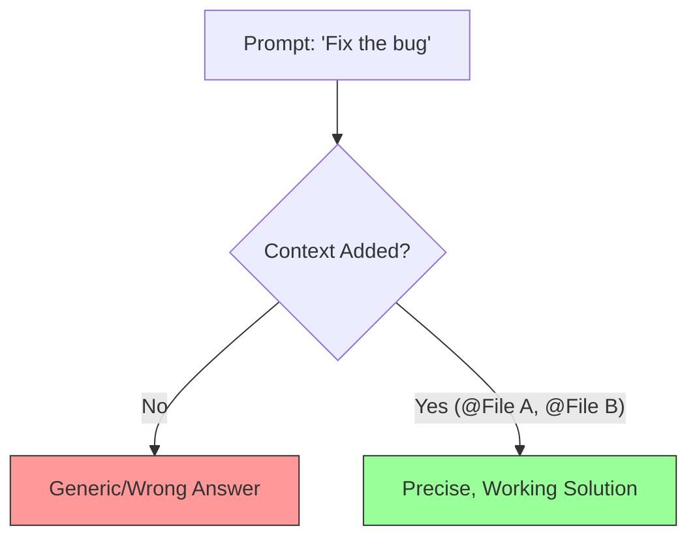

# Module 03: Context Engineering

*The art of feeding the AI exactly what it needs.*

## 1. The "Garbage In, Garbage Out" Rule

AI coding is not magic; it is **Probability + Context**.
If you don't show the AI your `user_schema.sql`, it will *guess* your database columns. It will be wrong.

**Context Engineering** is the skill of curating the "Prompt Payload."



## 2. The Context Tools (@Symbols)

Press `@` in Chat or Cmd+K to open the Context Menu.

| Symbol | Name | Function | Best Use Case |
| :--- | :--- | :--- | :--- |
| **@Files** | Reference File | Reads specific file contents. | When you know *exactly* where the relevant code is. |
| **@Codebase** | Semantic Search | Searches repo for matches. | "Where is the auth logic?" or "How do we handle errors?" |
| **@Docs** | Documentation | Reads external docs. | "How do I use the new Next.js 14 App Router?" |
| **@Web** | Live Search | Googles for you. | "What is the latest Stripe API version?" |
| **@Git** | Git Context | Reads commits/diffs. | "Write a commit message for these changes." |

## 3. The Strategy: Precision vs. Recall

* **High Precision**: Manually adding `@File`. You guarantee the AI sees it.
* **High Recall**: Using `@Codebase`. You hope the AI finds it.

**The Golden Rule**: If you know the file name, **Always** use `@File`. Only use `@Codebase` for exploration.

## 4. Feature Spotlight: The `.cursorrules` file

You can create a `.cursorrules` file in your root directory to set "Global Context."

* **Purpose**: Rules the AI *always* follows.
* **Example Content**:

    ```text
    - Always use TypeScript.
    - Use 'const' over 'let'.
    - Style guide: TailwindCSS.
    ```

* **Why**: Saves you from typing "Use TS" in every prompt.

## 5. Guided Hands-On Exercise: The Dependencies Link

*Goal: Generate code that depends on a file you haven't opened.*

**Setup**:

1. Create `models.ts`:

    ```typescript
    export interface User {
        id: string;
        email: string;
        isPro: boolean;
        lastLogin: Date;
    }
    ```

2. Close `models.ts`.
3. Open a new file `utils.ts`.

**Action**:

1. Open Chat (`Cmd+L`).
2. Type: "Write a function `canAccessFeature` that checks if a user is Pro."
    * *Result*: It might guess generic fields.
3. **Retry**: Type "Using @models.ts, write a function `canAccessFeature`."
    * *Result*: It will correctly use `isPro` and the `User` interface.

## 6. Common Mistakes

- **Overloading Context**: Adding 50 files. The AI gets confused ("Context limits").
* **Under-loading**: Asking "Why is my build failing?" without adding the error log or config file.

## 7. Key Takeaways

1. **Be Specific**: `@File` > `@Codebase`.
2. **Be Systematic**: Use `.cursorrules` for preferences.
3. **Document Indexing**: Add your framework docs (Settings -> Features -> Docs) if Cursor doesn't know them.

## 8. When to use vs. When NOT to use

| Context | Use When... | Avoid When... |
| :--- | :--- | :--- |
| **@Codebase** | "Where is X defined?" | You want to edit `main.py` (Just use `@main.py`). |
| **@Docs** | Using a niche/new library. | Using standard JS `Array.map` (It knows this already). |

---
*Next Module: Agentic Workflows (Composer)*
