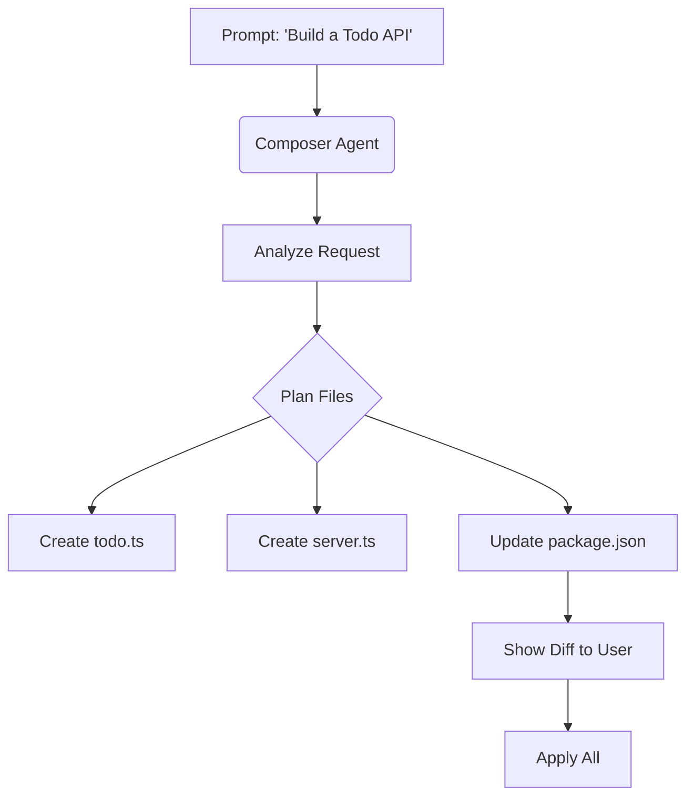

# Module 04: Agentic Workflows (Composer)

*Moving from "Coding Assistant" to "Coding Agent".*

## 1. The Paradigm Shift

Up to now, we've discussed **Assistance**:

- Tab: "Finish my line."
- Cmd+K: "Fix this function."
- Chat: "Explain this file."

**Composer (`Cmd+I`)** is **Agentic**:

- "Create a new feature."
- "Refactor this entire module."
- "Create 3 files: index, styles, and utils."

Composer has **Write Access** to your file system. It creates, deletes, and modifies multiple files simultaneously.

## 2. How Composer Works

Composer sits as a floating window (separate from Chat).

## 3. The "Yolo" Mode (Control-Return)

*Note: Depending on your version, Composer has "Normal" and "Agent" modes.*

- **Normal**: Proposes edits, waits for you to click "Apply".
- **Agent**: Can run terminal commands, fix lint errors it created, and iterate.

## 4. Guided Hands-On Exercise: The "Instant Micro-Service"

*Goal: Create a working API with multiple files in ONE prompt.*

**Setup**:

1. Open an empty folder or navigate to a `tmp` folder.
2. Open Composer (`Cmd+I` or `Control+I`).

**The Prompt**:
> "Create a simple Express.js server.
>
> 1. `server.js`: Basic setup on port 3000.
> 2. `routes.js`: GET /hello and POST /data.
> 3. `utils.js`: A helper function to log requests with timestamps.
> connect them all together."

**Action**:

1. Watch it generate the plan.
2. Watch it write the code for all 3 files.
3. Click "Accept All" (or "Save All").

**Validation**:

- Check the file explorer. You surely see 3 new files.
- This would have taken 10 minutes manually; it took 30 seconds.

## 5. Advanced Strategy: The "Refactor Agent"

Composer is exceptional at **Broad Refactoring**.
**Scenario**: You want to change your CSS strategy or move logic from Controller to Service layer.

**Prompt**:
> "Move all business logic from `routes.js` into a new file `controller.js`. Keep `routes.js` only for defining endpoints. Update imports accordingly."

Composer maintains the mental map of the file relationships and updates both files in sync.

## 6. Common Mistakes

- **"Build me Facebook"**: Asking for too much complexity at once creates garbage.
  - *Fix*: Break it down. "Buid the auth layer." Then "Build the feed."
- **Ignoring the "Apply"**: In Composer, code isn't saved to disk until you Accept/Apply. If you close the window, you might lose the draft.

## 7. Key Takeaways

1. **Composer = Multi-File Creator**.
2. **Context is still Key**. You can reference files in Composer too!
3. **Review is Mandatory**. Great power involves great responsibility. Check the generated files.

## 8. When to use vs. When NOT to use

| Feature | Use When... | Avoid When... |
| :--- | :--- | :--- |
| **Composer** | Creating new features / Multi-file refactors. | Fixing a typo in one line (Overkill). |
| **Chat** | Asking questions without easier editing. | You know exactly what code you want written. |

---
*Next Module: Production Hygiene (Docs & Tests)*
